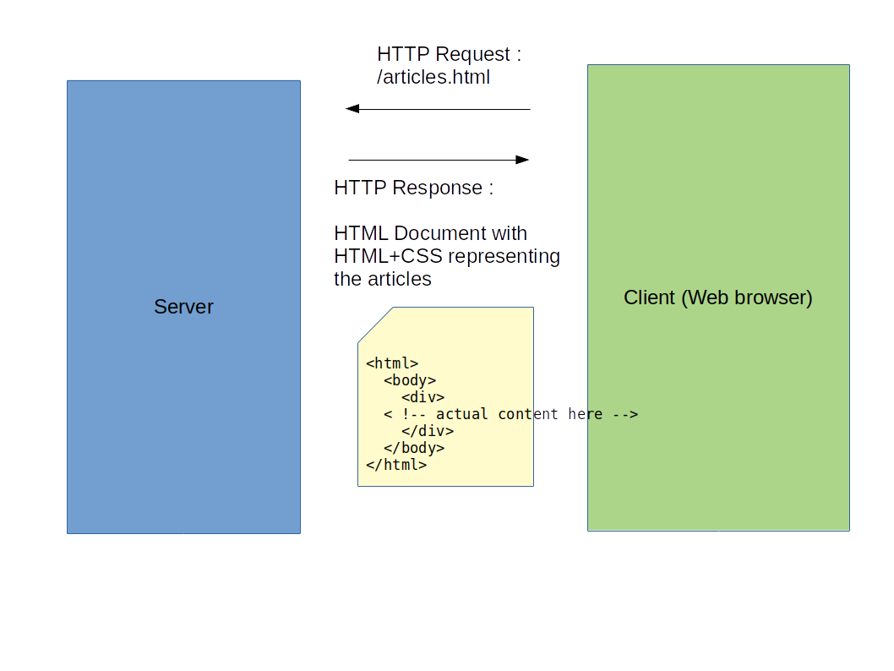
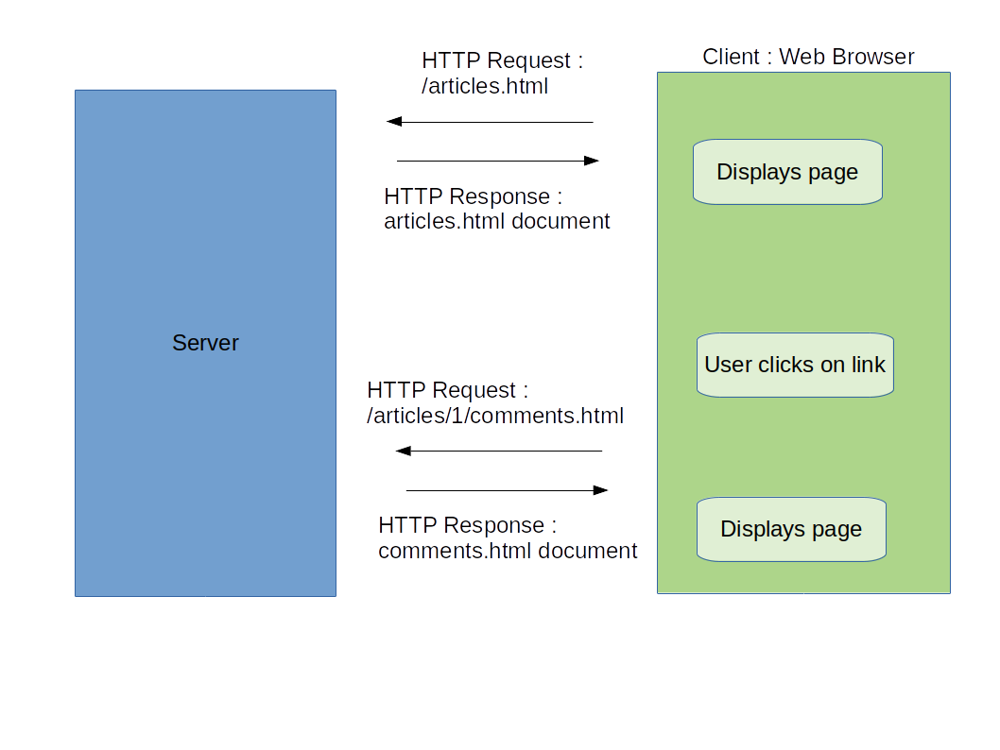
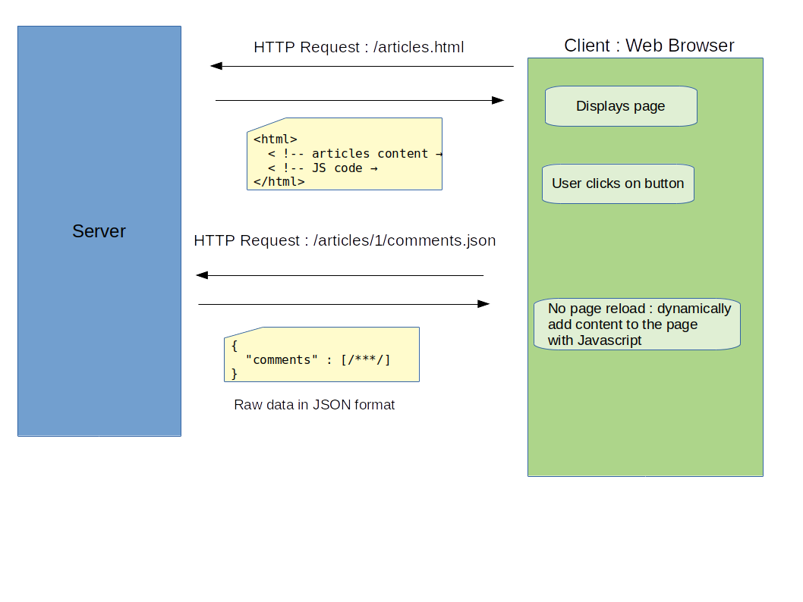
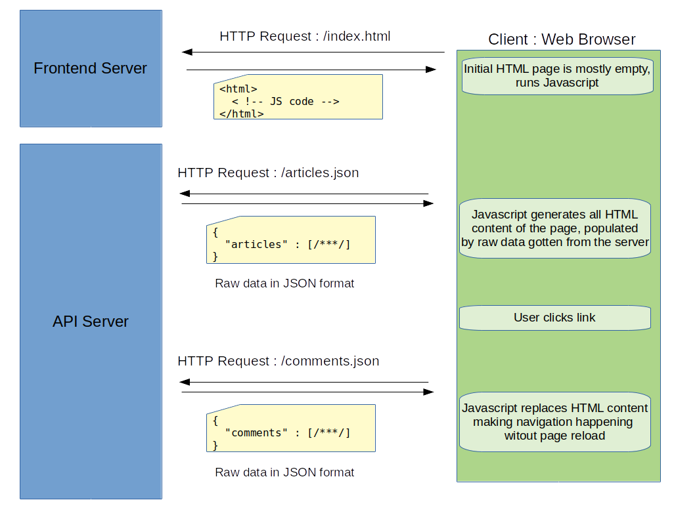
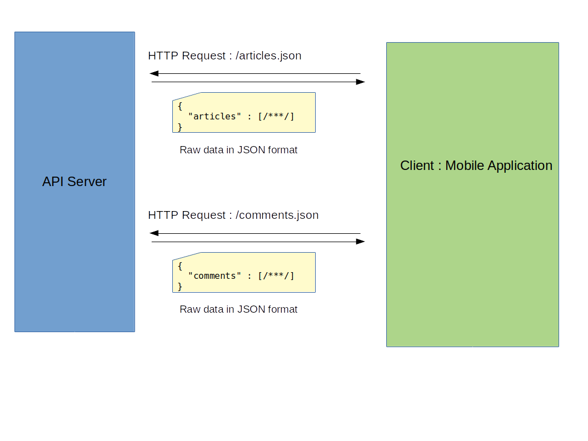

# Frontend Web Development

Quentin Richaud

qrichaud.pro@gmail.com

---

# What is a web application

---

# What is a web application : The Server Side

- The job of coding the server is called "backend development"
- The logic on the server can be more or less complex :
    - Simply serving static files
    - Dynamically generating HTML files
    - Using a database
    - Relying on other distributed services
    - etc.

---

# What is a web application : The Server Side

- The server is just a computer, it can run any compiled or interpreted language. Backend development
  can be done with a lot of language and frameworks.
- Popular languages for backend development : 
    - PHP, Java, Python, Ruby, C#, Javascript (confusing, I know)

- Popular frameworks :
    - Laravel, Symfony (PHP)
    - Spring (Java)
    - Django (Python)
    - Ruby on Rails (Ruby)
    - ASP.NET (C#)
    - Express.js (Javascript)

---

# What is a web application : The Client Side

The client is your web browser (Firefox, Chrome, Edge, Safari, …).

It displays the HTML pages returned by the server.

Once the page is laoded, everything that happens in your browser is the client side logic.

Programming the things that run in the browser (on the client side), is what we call **frontend development**.

---

# Frontend

Frontend logic can be more or less complex.

Most basic : static pages (once loaded in the client).

Example : <https://css-tricks.com/should-a-website-work-without-javascript/>

---

# Basic frontend

---

# Frontend

Sites with a little bit of logic running in the browser : 

- hiding/showing elements
- making a message window appear
- opening/closing a menu
- reacting to events (clicks, focus, mouse move, keyboard keys pressed, …) 
- load more content without relaoding the page

We need something more than just HTML and CSS : Javascript

Example : <https://css-tricks.com/should-a-website-work-without-javascript/>

The button "Show All Comments" needs Javascript to work.

---

A little bit of frontend logic

---

# Frontend

Sites with a lot of logic in the browser : 

## Single Page Application 

They can look like standard websites, but once the page is loaded in the browser, it never reloads. All the navigation is made
by the Javascript code.

They allow to reuse the same server logic than a matching mobile application.

Example : Facebook, Twitter, …

## Web Applications

Websites that behave like a software. Example : Google Doc, Trello, Slack, …

---

---

---

# Presenting : Javascript

- It’s the only language web browsers understand and can run
- Unlike backend development : frontend development can't choose its language, it's Javascript *

\* In the near future, it won't be true anymore. Web Assembly is coming. Already working in the latest browsers.

---

# Javascript

Like HTML and CSS : we need every browser to agree on the standard of Javascript.

We want our code to run the same on any user machine. Even if the latest browser (Firefox for example) ships
with an amazing new Javascript feature, we can't rely on it if we want all our userbase to be able to use our application.

---

# Javascript History

- 1995: At Netscape, Brendan Eich created "JavaScript".
- 1996: Microsoft releases "JScript", a port for IE3.
- 1997: JavaScript was standardized in the "ECMAScript" spec.
- 2005: "AJAX" was coined and the web 2.0 age begins.
- 2006: jQuery 1.0 was released.
- 2010: Node.JS was released.
- 2015: ECMAScript 6 was released.

Javascript has **nothing** in common with Java. The name is a marketing stunt. 

---

# Javascript problems

- First version was developped in a very short period of time
- Suffered from the war of browsers in the 2000s' (many inconsistensies between versions of the language depending on the browser).
- Because we need to rely on the rate of adoption of new browsers by the users : hard to make quick improvments on the language 
- Despite the latest versions being modern and fixing many early versions flaws : many legacy code to deal with, and it is hard
  to change the habits of programmers

---

# Javascript today

The language is specificated by the ECMA organization. The official name for the standard version is ECMAScript.

## ECMAScript5 (or ES5)

The specification of javascript published in **2009** by ECMA. 

That’s the most supported version of Javascript in today browsers. It is estimated that 99.44% of users use a browser that can run ES5.

It lacks a lot of modern language features, it is not ideal to write programs in ES5. Especially, it doesn't have a module (import, export, namespace isolation) system.

## ECMAScript6 (or ES6).

Also named **ECMAScript2015**. The specification of the language published in 2015 by ECMA.

Its adoption is estimated at 97.66%.

ES6 adds a lot of features compared to ES5, and that is very important from a software engineering point of view. 
It allows to make cleaner and more solid code. We will see that later.

Although the high adoption rate of supporting browsers, old habits die hard, and most companie still required their applications
to be shipped with ES5 code only. (It was necessary up to 2 years ago, ES6 adoption was < 95%, but not so much today).

---

# Javascript today

Although originally designed to be a scripting language for the browser, Javascript can now be run natively on computer 
with Node.JS. 

This allow to make backend development in Javascript (and use it as a general purpose scripting language, like Python or Ruby, …)

Not the topic of this lecture however.

---

# How to run Javascript in my web page

Anywhere in your webpage, add a script tag : 

    !html
    <html>
      <head></head>
      <body>
        <!-- html content -->
        
      </body>
    </html>
    

It is recommended to put the script tags in the end of the `<body>` tag

All scripts will run sequentially.

You can also write javascript inline in the HTML file 

    !html
    <html>
      <head></head>
      <body>
        <!-- html content -->
        
      </body>
    </html>

---

# How to inspect and debug my code

Chrome developer tools (Firefox developer tools also exists).

CTRL+Maj+I (Mac : Command+Option+I)

---

# Basics of JS syntax

See live coding demo.

Resources : 

- Cheat sheet with many JS syntax reminders : <https://htmlcheatsheet.com/js/>
- An efficient introduction to JS : <https://www.codecademy.com/learn/introduction-to-javascript/modules/learn-javascript-introduction/cheatsheet>

---

# Advanced JS syntax and principles

These concepts are not necessary for basic JS developments, however for those wo want to go further : 

- JS is a Prototype Based Oriented Object language (unlike pure OO languages like Java). 
    - <https://en.wikipedia.org/wiki/Prototype-based_programming>
    - <https://developer.mozilla.org/en-US/docs/Web/JavaScript/Inheritance_and_the_prototype_chain>
- JS runs in a single threaded environment, the code is non blocking
- Althought not purely functionnal, JS encourages functionnal programming
- JS is designed to deal with asynchronicity a lot, by the use of callback functions, Promises,
  and the `async`/`await` syntax (which is syntaxic sugar around Promises).
- Understand how closures work in JS : <https://developer.mozilla.org/en-US/docs/Web/JavaScript/Closures>

---

# Manipulating the DOM with JS

The DOM (Document Object Model). It’s the programmatic way to represent and access the elements 
of my HTML page (every HTML tag `
`, `
`, … makes a DOM node).

Each element of the tree is a DOM node.

---

# Manipulating the DOM with JS

The web API provided by the browser in the JS runtime environment, allows us to access the content of the webpage
as DOM elements.

Operations we can do :

- Access one ore multiple DOM nodes
- Traverse the DOM : from one node, find parents, children or sibling nodes
- Modify existing nodes, create and insert new nodes in the DOM tree, delete existing nodes
- React on events happening on DOM elements : clicks, focus, …

---

# Manipulating the DOM with JS

Resources :

- Cheat sheets : 
    - <https://gist.github.com/thegitfather/9c9f1a927cd57df14a59c268f118ce86>
    - <https://github.com/anish000kumar/Javascript-DOM-API-cheatsheet>
- Exhaustive Documentation (MDN) : <https://developer.mozilla.org/en-US/docs/Web/API/Document_Object_Model/Introduction>

See live coding

---

# AJAX

AJAX means “asynchronous JavaScript and XML\*”.

Using Javascript to retrieve additionnal data from the server after the page as loaded, in order to dynamically update the
content of the page without a page reload.

\* Historically, XML was the preferred format for sending raw data. Nowadays we use JSON predominantly.

---

# AJAX

---

# AJAX : How to in JS code

## The old school way

The browser web API provides an object : the `XMLHttpRequest` object (see MDN doc for all details). 
Ofter shortened as XHR.

<https://developer.mozilla.org/en-US/docs/Web/API/XMLHttpRequest/Using_XMLHttpRequest>

Despite the name, you can send and receive any format of data, not just XML.

## The modern way (ES6)

The browser web API provides the `fetch()` function. <https://developer.mozilla.org/en-US/docs/Web/API/Fetch_API>

## Using an external library

External libraries will use XMLHttpRequest  or fetch() under the hood. However they can give you a more flexible API
to make AJAX.

Some libraries for AJAX : jQuery (outdated, and does many other things than ajax), axios, SuperAgent.

---

# AJAX - Pro and cons

## XMLHttpRequest

- Pro : Oldest standard, most likely to be supported by browsers, and known by developpers.
- Cons : the API is hard to use, ugly code.

## fetch

- Pro : modern and easy to use API, natively supported by browsers (no library overhead)
- Cons : "only" supported by 95.66% of browsers on the market

## external library

- Pro : modern and easy to use API, will convert to XMLHttpRequest under the hood if browser does not support fetch()
- Cons : add overhead to native JS code (size of JS library adds weight to your website)

---

# Modules in javascript

Almost all modern languages have a module system, in order to isolate variable naming scope between the different source files.

A variable `a` declared in a source file `a.source` won't be accessible and modifiable in another source file `b.source`.

The way to share variables (or objects, funntions, …) between source file is usually done trough an import/export mechanism.

For example in Java : 

    !Java
    // MyClass.java
    
    public class MyClass {
    }

    !Java
    // Main.java
    import org.package.MyClass;

`MyClass` is accessible from the outside only if I explicitly declare it `public`. Outside code needs to explicitly import it.

---

# Modules in javascript

**ES5 has no module system**. Everything is global and the global namespace is shared between all scripts running in the page.

    !html
    <html>
      <head></head>
    
      <body>
        
        
      </body>
    </html>

. 

    !javascript
    // scriptA.js
    var a = 'hello';

. 

    !javascript
    // scriptB.js
    a = 'changing my variable';

---

# Modules in javascript

## ES6 introduces native modules

    !html
    <html>
      <head></head>
    
      <body>
        
      </body>
    </html>

. 

    !javascript
    // scriptA.js
    var a = 'hello';
    var b = 'world';

    export {a};

. 

    !javascript
    // scriptB.js
    import {a} from "./scriptA.js";

    a = 'changing my variable';
    // won't affect 'a' in scriptA.js because a is a local copy of the exported variable

---

# Module in JS : going further

Before the introduction of ES6 modules, the module problem was solved by external JS libraries that would 
simulate the fonctionality of a module system (that's why we say ES6 are native modules, because other module
systems were non native).

Several systems were competing, we can still encounter them in existing codebase, althought ES6 modules tend to replace them.

Some of them : CommonJS, AMD, UMD.

The commonJS syntax is still the norm for node.js code (Node has been slow to implement support of ES6 modules).

---

# Module in JS : going further

## Example of CommonJS syntax

    !javascript
    // scriptA.js
    var a = 'hello';

    module.exports = {
      a: a
    };

.

    !javascript
    // scriptB.js
    var importedModule = require('./scriptA.js');
    var a = importedModule.a; 

---

# A popular external library : JQuery

We saw how it is possible to make a lot of things with the Javascript and the native web APIs provided by all browsers.

Browsers supporting ES6 and moderns APIs such as `fetch()` allow us to write efficient code without relying on an external library.

In the old times on ES5, making things only with Javascript was a little bit tedious (see how long it is to build an XMLHttpRequest object for example).

There are a lot of JS libraries that provides tools to do common task a lot easiers. The most popular library from the end of 2000s’ and beginning of 2010s’ was JQuery.

Nowadays it is outdated, and not a lot of new projects use it. However it is still present in many existing applications, 
and had a huge influence in the Javascript community. So it’s important to have a look at it.

---

# Why JQuery in 2020 ?

It is important you know JQuery in 2020 because : 

- It had a huge influence in the past 15 years in web development
- You will still see it in a lot of legacy code base
- Many modern frameworks and libraries were influenced by it
- It helper shape the modern Javascript culture

---

# Why JQuery in 2020 ?

However :

- It is outdated : many necessary features it provided are now covered by ES6 and browsers native APIs
- It's a huge catch-all library. If you need a library to do a certain task (Ajax for example), you better find a specialized
  and smaller library aimed at solving your problem.
- If you have complex code to write, you should use modern frameworks such as Angular, React or VueJS (among others). Using only
  JQuery for complex features will result in spaghetti code.

I encourage you to know JQuery to improve your knowledge of web development history. I strongly discourage you to use JQuery in new projects. 

A frontend developper that doesn't know how to solve a problem without JQuery is not a good frontend developper.

<http://youmightnotneedjquery.com/>

---

# Using JQuery

Because JQuery is an old library, it doesn't use modern module system. 

To import it : include the libary source file in your HTML document before your script. It will create a global variable named "$" 
that has all the library functions as properties.

The official documentation : <https://api.jquery.com/>

A cheat sheet : <https://github.com/ga-wdi-lessons/js-jquery/blob/master/jquery-cheat-sheet.md>

See live demo 

---

# What next?

For this lesson, you have no mandatory homework.

Next time, on January 5th and 6th, we will see the modern developping tools of the javascript ecosystem (NPM, Babel, Webpack).

We will see a modern frontend framework : Vue.js

The assignment at the end of these lectures, you will have to build your frontend application as a Single Page Application (with Vue.js),
using the backend API you developped with Guillaume Ehret.

In order to prepare this assignment, you can already develop the HTML and CSS skeleton (using Bootstrap), and fill it with fake data. We will then
add the Javascript and Vue.JS logic to have the real behavior.

---

# What next ?

You can play with the demo code provided in the lecture repository.

Under `./demo_code`, check the README in order to launche the demo API server. You have an API which gets you articles and comments in JSON format.
You can also create new articles and comments with POST request (the API is documented in the README).

You can also launche a second, basic HTTP server, that will serve all static files in the `./frontend` directory. You will find the demo code used
during the live coding of this lecture.

You can reuse the basic HTML code I provided and extend it with Javascript and/or Jquery to have the following functionalities : 

- An index page listing all articles. Get the articles data with an AJAX request and populate the webpage. Show only the first 100 characters 
  of the articles content for each article.
- An article detail page, in which you will have the whole article and the comment thread. Get all data with AJAX. Make a "new comment" section, allowing
  users to post new comments. 
- You can add loading animations : on page load (when fetching the initial content), or on network operation (for example sending a new comment). You
  can simulate a slow network in the Chrome Developper Tools, under the tab "Network", setting the "Throttling" dropdown from "Online" to "Slow 3G"

