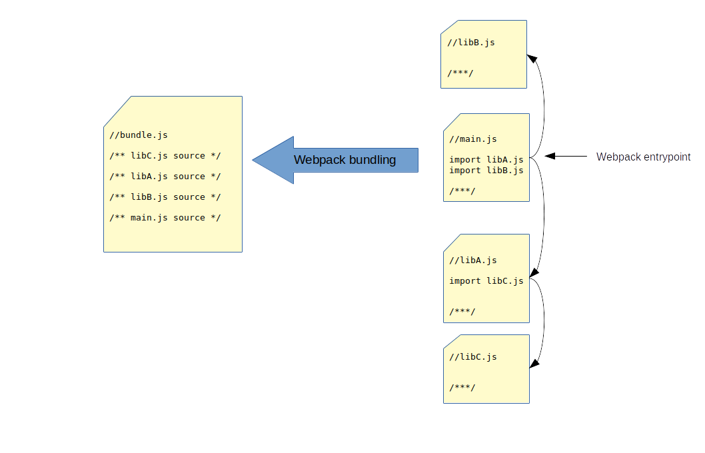
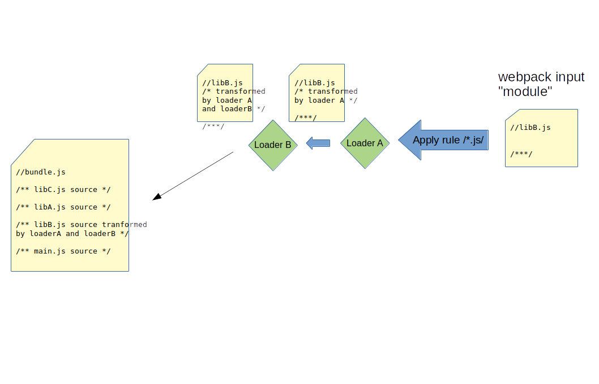

# Frontend Web Development

Quentin Richaud

qrichaud.pro@gmail.com

---

# Basics of NodeJS

- Install `node` on your machine
- Write javascript source file
- Run it with `node yourSource.js`

---

# NodeJS modules

JS had no native modules until ES6 (2015). 

Several non native module systems were created to overcome this missing feature. 

NodeJS uses the commonJS module convention.

---

# NodeJS : CommonJS modules

    !Javascript
    // myLib.js
    function sayHello() {
      console.log('Hello');
    }
  
    module.exports = {
      sayHello: sayHello
    }  

.

    !Javascript
    //index.js
    const myLib = require('./myLib'); // '.js' suffix optionnal
    myLib.sayHello();
  

---

# NodeJS : importing native API

NodeJS runtime provides a native API, for importing objects from this API you don't have
to install third party libraries.

For example, the import of `readline` below, works out of the box.

<https://nodejs.org/docs/latest/api/>

    !Javascript
    const readline = require('readline');

    const rl = readline.createInterface({
      input: process.stdin,
      output: process.stdout
    });

    rl.question('What is your name?\n', (answer) => {
      console.log(`Hello ${answer}!`);
      rl.close();
    });

--- 

# NodeJS : using 3rd party libraries

For using 3rd party libraries, we need a way to install them. For example with the lirbrary `lodash` which provides utilities <https://lodash.com/>.

- Manual option : 
    - download the library [source file](https://raw.githubusercontent.com/lodash/lodash/4.17.15-npm/lodash.js)
    - save it among our source files, as `lodash.js`
    - write `require('./lodash.js')` in our source file

---

# Introducing node package manager : `npm`

You need to install `npm` on your machine

To use `npm`, your project itself must be a npm projet : 

- setup with the command `npm init`
- it generates a `package.json` file at the root of your project

---

# Install dependencies with npm 

Run `npm install lodash`

- it fetches the package named `lodash` from npm repository (see <https://www.npmjs.com/>)
- it downloads it, and store under the directory `./node_modules/`
- it saves the dependency in your `package.json` :

.

    "dependencies": {
      "lodash": "^4.17.20"
    }

- With git (or another VCS) : you don't include `node_modules`
- When sharing a project, you run only `npm install` to install all dependencies configured in the project's `package.json`

---

# NPM dependencies

To understand how package version numbering works, see semver <https://docs.npmjs.com/cli/v6/using-npm/semver>

---

# Import a dependency installed by `npm`

Once we installed the library with `npm`, we can import it in our source files. This time we don't need to write a relative
path to the library.

    !Javascript

    const lodash = require('lodash');
    
    let array = [['a', 'b'], ['c', 'd']];
    console.log(lodash.flatten(array).join(', '));

Npm algorithm to find the JS file to import : 

- looks for the first parent directory with a `node_module` directory
- looks for a package (directory with package.json file at root) named `lodash`
- imports the JS file pointed by the `"main"` property of `package.json`

---

# NPM scripts

We can add scripts commands to the `package.json` file.

    "scripts": {
      "start": "node index.js"
    }

then run `npm run start`

Scripts are useful for : 

- Development workflow (only having to run some predefined commands)
- Testing (and Continuous Integration)
- Deployment 

---

# Exercise : setup NPM for this project

Go into the folder `example/3_npm_exercise`. Setup of the project : we want to make a small HTTP server with NodeJS,
which will serve a Single Page Application. 

For this to work : we put static assets files (HTML, JS, CSS, images, fonts)
into a folder `/dist`. The HTTP server must follow this logic : 

- If the requested path matches a static asset, it must serve the asset file
- Otherwise, for any request (any path), it must serve the `index.html` file

We put the server code under the directory `/server`, it has only one source file `index.js`.

---

# Exercise : setup NPM for this project

- Analyse the server code `server/index.js` to determine which dependencies are needed
- Install the dependencies with `npm install` (check that your package.json is updated)
- Add a script to your `package.json` in order to be able to launch the server with the command `npm run start`

---

# But what about frontend?

NodeJS tools will help us to process our client javascript code, before shipping it to the browser.

---

# JS Transpilation

Problems : 

- New versions of JS (ES6, and ES7+) are not supported by browsers
- It's hard to code using only old features 
- It's pointless to have a language that can't evolve because of browser support

Solution :

Transpilation. The act of transforming ES6 (or newer version) code, into ES5 code.

---

# Compilation vs Transpilation

Compilation : translate code written in a programming language into machine code

Transpilation : translate code written in a programming language into code written in another programming 
language 

---

# Transpilation into JS

Since browsers can only understand javascript, if we want to develop frontend code in another language,
it is possible using a transpiler that will translate that language into javascript to ship to the browser.

Examples : 

- Typescript : A strongly typed language, that looks like javascript with types
- CoffeeScript : a language that looks like ruby and transpiles to javascript

---

# Babel 

The "universal" javascript transpiler. Its goal is to transpile any newer version of Javascript (ES6, ES7 and +) into
older versions of Javascript.

Example : 

      // ES6 
      let name = 'Bob'; 
      let a = () => {
        console.log(`Hello ${name}`);
      };

If configured to transpile down to ES5, Babel will output : 

      // ES5
      var name = 'Bob';
      var a = function() {
        console.log("Hello ".concat(name));
      } 
        

---

# Using Babel

- install it via `npm` : `npm instal @babel/core @babel/cli @babel/preset-env`

Babel is an npm package with a Command Line utility, which can be called in 2 ways :

- `./node_modules/.bin/babel`
- Using the `npx` utility (install on your machine) : `npx babel` (this is just a shortcut to the first option)

Configure babel by creating a `babel.config.js` file at the root of the directory :

    module.exports = {
      "presets": ["@babel/preset-env"]
    }

Run : `npx babel src/client -d dist`, this will transpile any js file from `src/client` and output it 
into `dist/`.

---

# Setting up npm scripts

    "scripts": {
      "build": "babel src/client -d dist",
      "start": "npm run build && node src/server/index.js"
    }

Now this is our workflow :

- we don't write our client code directly into the `dist/` directory (in fact, this directory should not be versionned)
- we write our code under `src/client/`
- the `npm run build` command builds our client code into the `dist/` directory
- the `npm run start` command builds the client code **and** starts our server which will serve the code in the `dist/` directory

---

# Babel

Babel has many more configuration option. To go further, you can check the official babel documentation : <https://babeljs.io/docs/en/>

---

# Introducing Webpack

- Webpack is a bundler for JS client code
- It takes several code sources (that depend on one another, through JS import/exports), and bundles them into a 
  single source file
- It is very flexible and can apply a chain of loaders on the input files (for example : babel-loader will
  transpile files with babel before they are bundled)

---

# Webpack bundling

---

# Webpack bundling demo

Go into `examples_solution/5_webpack1`.

- The `dist/` directory is not versionned. It will be generated again at each build
- Client source files that aren't processed by webpack are stored in `static_assets/` and copied to `dist/` on build
- Client source files bundled by webpack are stored under `src/client/`.
- Server source files are stored under `src/server/`.

Webpack is configured with the file `webpack.config.js`.

What our configuration will do on build : 

- Copy static files from `static_assets/` into `dist/`
- Webpack will take the entry point `src/client/main.js`. 
- It bundles the imports made by `main.js` (and further import from these dependencies) : `sayHello.js` and npm dependency `lodash-es`
- It creates an output bundle file `dist/main.bundle.js`
- See that our `index.html` links to `main.bundle.js`

---

# Webpack bundling demo

Run yourself webpack : `npx webpack` or `./node_modules/.bin/webpack`. 

Our run through the configured npm command : `npm run build`

Now inspect the generated file : `/dist/main.bundle.js`.

Start the nodeJS server with `npm run start` (this will build again), and see the browser console output in <http://localhost:3000>

You can turn off minification to see what the bundle look like.

---

# Webpack bundling demo

What are the advantages of webpack :

- For browser that don't support ES modules (prior to 2015) : allow to develop using ES modules, and give the browser only one source file
  (also avoid ES5 global namespacing conflicts)
- Even with browsers supporting modules : give only one source file that is optimized
- Many optimizations possible (code translation, minification…)
- Tree shaking : we only bundled the `flatten` function of `lodash-es` instead of having the browser download the whole `lodash` library
- We can process any kind of file through additionnal loaders

---

# Adding loaders 

---

# Adding loaders: babel loader

Go into `examples_solution/6_webpack2`.

See this section of `webpack.config.js` : 

    !Javascript
    module: {
      rules: [
        { test: /\.js$/, use: 'babel-loader' }
      ]
    },

It means, for each module ("module" is any file imported from the depencency tree built from webpack entrypoint), that
matches the regex `/\.js/`, apply the loader `babel-loader`.

The loader `babel-loader` will process the file with `babel`, using the configuration found at `babel.config.js`.

Run `npm run build`, and see the output file `dist/main.bundle.js`, and see that `let` keywords have been replaced with `var`.

---

# Loaders for any type of file

Loaders allow us to import, from the JS entrypoint, any kind of file. If the right loader is applied, it will take these modules and transform into
a JS module, to include to the bundle.

Each loader will document what it does with the input module.

For example `style-loader` allow us to import CSS files as modules, it will generate a JS module that inserts at runtime the CSS rules into a 
`<style>` tag.

---

# Loader for CSS : an example

Go into the `examples_solution/7_webpack3` directory.

Here, we removed the `style.css` file from `static_assets/`. Instead we want this file to be processed by webpack.

    !javascript
    // main.js
    import styles from './assets/styles.css';

    // webpack.config.js
    module: [{
      test: /\.css$/i,
      use: ['style-loader', 'css-loader']
    }]
    

---

# Loader for CSS : example

- Webpack takes the entrypoint `main.js`
- It parses the import for `"assets/styles.css"`.
- It applies the matching module rule `/\.css$/`
- It applies the 2 loaders in the chain, in reverse order (that's webpack convention)
- `css-loader` : analyzes the CSS file, and if `url()` instructions are present, it adds the pointed files into webpack  module dependency tree
- `style-loader` : generate JS code that will generate a `<style>` tag into the HTML document, and inject all the CSS of the file
- The `styles` object imported in our `main.js` is just an empty object

---

# Webpack

There is an infinity of possibility thanks to loaders. Webpack becomes the swiss-knife of frontend development : we can process
any file (JS code, CSS, images, fonts, …) needed by our frontend in webpack.

We can invent new file formats, and write loaders to process them into JS assets understandable by the browser.

That's what does Vue.js framework : it has its own `.vue` file format, which are processed by their loader `vue-loader`.

--- 

# Webpack plugins

In addition to loaders, we can use plugins. Plugins allow to generate more side effects to processed files. A loader can only
transform any file into a JS file. A plugin can interact with processed files to do anything it wants.

For example : we want to remove the npm script that does `cp static_assets/* dist/`, we can use several webpack plugins that
will detect all assets imported from `main.js` and copy them into `dist/`.

---

# A more complete webpack example

Go into the directory `examples_solution/7_webpack4`.

- See the use of the plugin `html-webpack-plugin`
- The interest of generating files under `dist/` with a hash in their name (to avoid caching problems)
- This time, we don't use `style-loader` for CSS, but the plugin `mini-css-extract-plugin`, coupled with its loader
- We also have a loader for image files. Can you see how the image `email.png` ends up included into the webpack dependency tree? What
  is the effect of `file-loader` on this file?

---

# A few examples of what a complete webpack config can do 

- Having different behavior between builds in development mode and production modes (exemple of CSS loading & minification)
- Having a live server for development, that automatically reloads and rebuilds when you change source code
- Transpiling stylesheets from more evolved languages (for example SASS to CSS, or postCSS to CSS)
- Add syntax checker when building : ESLint, Prettier…
- Transforming CSS classes names to namespaced class names to avoid global CSS namespace collision

---

# Finally : source maps

Problem : webpack transformations are great, but we can't debug our code anymore in chrome developper tools.

Solution : generate "source maps" : additional information that maps the generated code to your original source file. Chrome devtools
understand these file and will you show in the debugger your original code, even though it is running the code generated by webpack.

See the example in `examples_solution/9_webpack_sourcemaps`. We have added this line to our `webpack.config.js` :

    devtool: 'eval-source-map',

Notice how the format of `dist/main.bundle.js` has changed. That's webpack way to make source maps. There are several options possible
to include source maps, they are all a compromise between : 

- generation time
- quality of mapping to the original source

---

# Source maps

Launch `npm run start`, and with Chrome Developper Tools, see that you can put a breakpoint into your original 
`main.js`, although it is `main.bundle.js` that is running.

---

# Webpack conclusion 

Webpack is now an essential tool in the world of frontend development.

The official documentation is excellent : <https://webpack.js.org/concepts/>

It is recommended to use existing, boilerplate, webpack configurations, to bootstrap your project.

There are many tools, (some of them provided by the big JS frameworks : angular, react, vue), that can generate
an out of the box working webpack configuration for you.
